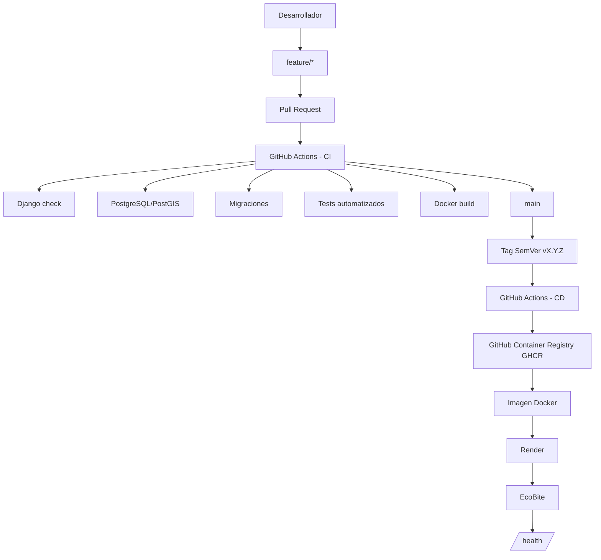

# Arquitectura y flujo DevOps de EcoBite

## Objetivo

Este documento describe la arquitectura DevOps implementada para EcoBite y la relación entre el código fuente, la integración continua, la generación del artefacto Docker, el registro de imágenes y el despliegue en Render.

## Flujo de entrega

## Componentes

| Componente | Responsabilidad |
|---|---|
| GitHub | Repositorio, ramas, Pull Requests, releases y trazabilidad |
| GitHub Actions CI | Validación de Django, migraciones, pruebas y construcción Docker |
| GitHub Actions CD | Construcción y publicación de imágenes mediante tags SemVer |
| GHCR | Registro de imágenes Docker |
| Docker | Empaquetado y ejecución reproducible |
| Render | Ejecución del contenedor en la nube |
| PostgreSQL/PostGIS | Persistencia y soporte geoespacial |
| `render.yaml` | Configuración declarativa del servicio de Render |
| `build.sh` | Preparación del contenedor antes de iniciar Gunicorn |
| `/health/` | Verificación de disponibilidad y versión del servicio |

## Flujo de cambios

1. El desarrollo se realiza en una rama de trabajo.
2. Se abre un Pull Request hacia `main`.
3. CI instala dependencias y prepara PostgreSQL/PostGIS.
4. CI ejecuta `python manage.py check`, migraciones, pruebas y Docker build.
5. Una vez aprobado y fusionado el Pull Request, `main` representa el estado integrado.
6. Las versiones se identifican mediante Semantic Versioning.
7. Un tag `vX.Y.Z` activa el pipeline CD.
8. CD construye y publica la imagen Docker en GHCR.
9. Render ejecuta la aplicación mediante la configuración definida en `render.yaml`.
10. El servicio puede verificarse mediante `/health/`.

## Separación de responsabilidades

El repositorio contiene el código de aplicación y la configuración necesaria para construir el artefacto. GitHub Actions automatiza las validaciones y la publicación. GHCR conserva las imágenes generadas y Render proporciona el entorno de ejecución.

Esta separación permite que una versión del código pueda asociarse con un artefacto Docker concreto y, posteriormente, con un servicio desplegado.

## Evidencia

La arquitectura se puede demostrar mediante el repositorio, los workflows de GitHub Actions, los Pull Requests, los tags/releases, GitHub Packages, `render.yaml` y el endpoint `/health/`.
