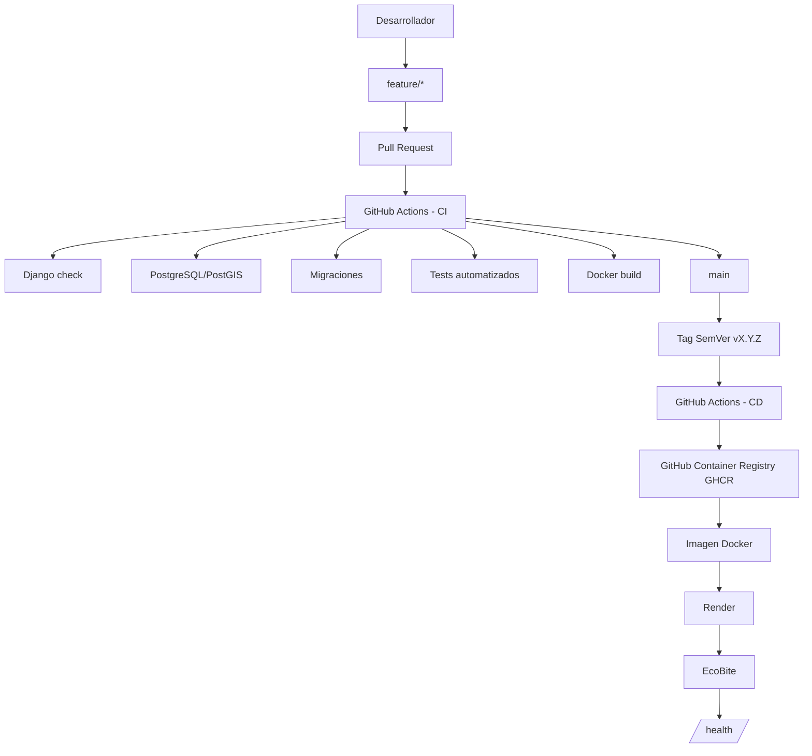

# Arquitectura y flujo DevOps de EcoBite

## Flujo de entrega

## Componentes

| Componente | Responsabilidad |
|---|---|
| GitHub | Repositorio, ramas, Pull Requests y trazabilidad |
| GitHub Actions CI | Validación, tests y construcción de la imagen |
| GitHub Actions CD | Publicación de imágenes Docker mediante tags SemVer |
| GHCR | Registro de imágenes Docker |
| Docker | Empaquetado y ejecución reproducible |
| Render | Despliegue del contenedor en la nube |
| PostgreSQL/PostGIS | Persistencia y soporte geoespacial |
| `render.yaml` | Configuración declarativa del servicio de Render |
| `/health/` | Verificación de disponibilidad del servicio |

## Flujo de cambios

1. El desarrollo se realiza en una rama `feature/*`.
2. Se abre un Pull Request hacia `main`.
3. CI ejecuta validaciones, migraciones, tests y build Docker.
4. Una vez integrado el cambio, `main` representa el estado estable.
5. Las versiones se identifican mediante Semantic Versioning.
6. Un tag `vX.Y.Z` activa el pipeline CD.
7. CD construye y publica la imagen en GHCR.
8. Render utiliza el contenedor para ejecutar EcoBite.
9. Render verifica el endpoint `/health/`.

## Evidencia

Las ejecuciones de GitHub Actions, Pull Requests, commits, configuración de Render y versiones publicadas constituyen la evidencia operativa del flujo descrito en este documento.
